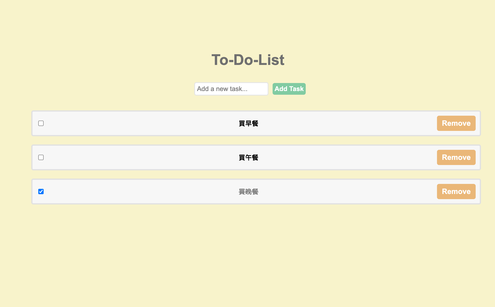

# A simple ToDoList

## 📋 Description

A simple ToDoList with Redux.

- Create(Add new task)
- Read(Task view)
- Update(Complete task)
- Delete(Remove task)

## 🛠️ Technologies & Requirements

- Node.js (20.6)
- react-redux
- redux

## 💻 Demo Screenshot



## 🚀 Getting Started

1. Install the packages

```
$ npm install
```

2. Run the server

```
$ npm run dev
```

3. Open http://localhost:3000 to view it in your browser.

## 👤 Author

Email:yiting536@gmail.com

## ⭕️ Warning

This is purely for practice and not for any profit-making purpose.Thanks!
